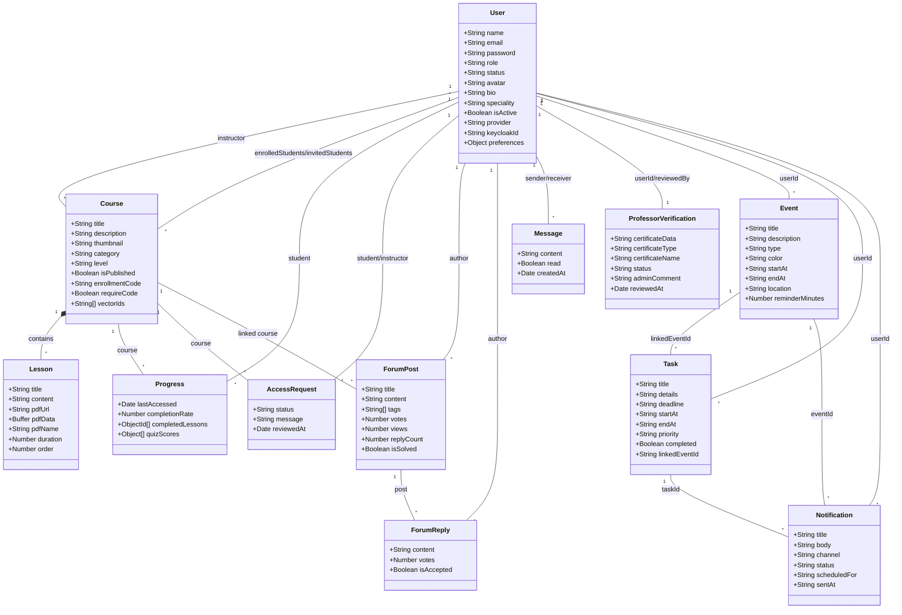

<div align="center">


# 🎓 EduAI — AI-Powered E-Learning Platform

**A next-generation e-learning platform supercharged by Generative AI.**
Built with a multi-provider AI tutor, adaptive quizzes, educational games, real-time messaging, community forums, and automated certifications — all secured by Keycloak SSO.

<br/>

[](https://nextjs.org/)
[](https://nodejs.org/)
[](https://mongodb.com/)
[](https://www.keycloak.org/)
[](https://ai.google.dev/)
[](https://docker.com/)
[](LICENSE)

</div>

---

## 📋 Table of Contents

- [Overview](#-overview)
- [Features](#-features)
- [Architecture](#-architecture)
- [Class Diagram](#-class-diagram)
- [Tech Stack](#️-tech-stack)
- [Project Structure](#-project-structure)
- [Getting Started](#-getting-started)
- [Environment Variables](#-environment-variables)
- [Running the App](#-running-the-app)
- [API Reference](#-api-reference)
- [User Roles](#-user-roles)
- [Teacher Onboarding Flow](#-teacher-onboarding-flow)
- [AI Architecture](#-ai-architecture-deep-dive)
- [Author](#-author)

---

## 🌟 Overview

**EduAI** is a full-stack e-learning platform built as a Final Year Project (PFE), designed to demonstrate the real-world integration of **Generative AI** into online education. It features a **multi-provider AI tutor** (Groq → OpenAI → Gemini failover chain), adaptive quiz generation, educational games, and a complete course management system — all unified under a premium SaaS-grade UI with light/dark theme support.

The platform supports three distinct user roles:

| Role | Description |
|---|---|
| 🎓 **Student** | Browse & enroll in courses, complete lessons, take AI quizzes, chat with the AI tutor, play educational games, earn certificates |
| 🧑‍🏫 **Instructor** | Create and manage courses & lessons, upload PDFs, view student analytics, manage access requests |
| 🛡️ **Admin** | Full platform control — user management, course oversight, global statistics |

---

## ✨ Features

### 🤖 AI & Intelligence
| Feature | Details |
|---|---|
| **Multi-Provider AI Tutor** | Per-course chatbot with automatic failover: Groq (Llama 3.3 70B) → OpenAI (GPT-4o-mini) → Gemini (2.5 Flash) |
| **Adaptive AI Quizzes** | Auto-generated MCQ quizzes tailored to lesson content and difficulty level |
| **AI Translation** | Translate any lesson into 6 languages (FR, EN, AR, ES, DE, ZH) |
| **AI Flashcards** | Auto-generated study flashcards from course content |
| **AI Summaries** | Automatic course content summarization |
| **AI Exam Generation** | Full exam paper generation from course material |
| **Auto-Ingestion** | Course content is automatically indexed into the AI context at server startup |

### 📚 Courses & Learning
| Feature | Details |
|---|---|
| **Course Catalog** | Browse by category, level, keyword with full-text search & pagination |
| **Multi-format Lessons** | Rich text content + PDF upload with automatic text extraction |
| **PDF Viewer** | Secure, authenticated in-browser PDF rendering (blob-based) |
| **Progress Tracking** | Lesson-by-lesson advancement with completion percentage |
| **Enrollment Management** | One-click enroll/unenroll with persistent state |
| **Auto Certification** | Completion certificate with QR code generated at 100% course progress |
| **Auto-Publication** | Course published automatically when ≥ 1 lesson; reverted to draft when 0 lessons |

### 📅 Calendar & Task Planner
| Feature | Details |
|---|---|
| **Weekly Calendar** | Interactive weekly view with drag-to-reschedule events |
| **Todo List** | Tasks with priorities (high/medium/low), completion tracking, and drag-to-reorder |
| **Event CRUD** | Create, edit, delete calendar events (courses, tasks, exams, deadlines) |
| **Calendar Linking** | Link tasks to calendar slots with conflict detection |
| **AI Schedule** | AI-suggested free study slots based on existing events |
| **Email Notifications** | Automated SMTP email reminders for upcoming events and task deadlines |
| **In-App Notifications** | Browser + toast notifications at 60min, 10min, 5min, and 0min before events |
| **Time-Slot Conflicts** | Database-level overlap detection with hatched visual indicators |

### 🎮 Educational Games
| Feature | Details |
|---|---|
| **Chess** | Full chess game with AI opponent |
| **Memory** | Card matching memory game |
| **MindCrash** | Brain training puzzle game |
| **Scrabble** | Word-building game |

### 👨‍🏫 Instructor Dashboard
- Create, edit, and delete courses and individual lessons
- Upload PDFs — text is automatically extracted and indexed for the AI tutor
- Analytics dashboard: enrolled students, lesson completion rates, published courses
- Detailed per-student progress view
- Manage student access requests
- Auto-publication: courses are published when they have at least one lesson

### 🛡️ Admin Panel
- Full user management (students & instructors)
- Course management and oversight
- Global platform statistics dashboard

### 💬 Community & Social
| Feature | Details |
|---|---|
| **Discussion Forum** | Course-linked threads with posts, replies, likes & categories |
| **Direct Messaging** | User-to-user messaging with emoji support |
| **AI Chat Interface** | Dedicated chat page for the course AI tutor |

### 🔐 Authentication & Security
| Feature | Details |
|---|---|
| **Keycloak SSO** | Centralized identity management with custom EduAI theme |
| **Google OAuth** | One-click social login via Keycloak Identity Provider |
| **JWT (RS256)** | Tokens verified via JWKS endpoint — stateless and secure |
| **PKCE S256** | Secure Authorization Code flow with code challenge |
| **Silent SSO Check** | `check-sso` on app load — seamless session restore without redirect |
| **Role-based Access** | Fine-grained route protection with `protect()` + `restrictTo()` middleware |
| **Teacher Invitation** | Admin creates teacher accounts → email verification → password setup → KC sync |

### 🎨 UI & Experience
| Feature | Details |
|---|---|
| **Light/Dark Theme** | Full theme support with CSS variables and cookie persistence |
| **Internationalization** | Multi-language support via custom i18n system |
| **Responsive Design** | Mobile-first layout with glassmorphism effects |
| **Global Search** | Platform-wide search modal |
| **Micro-animations** | Framer Motion transitions throughout |

---

## 🏗️ Architecture

```
┌─────────────────────────────────────────────────────────────┐
│                        CLIENT BROWSER                       │
│                    Next.js 14  (Port 3000)                  │
│       App Router · Tailwind CSS · Framer Motion · Zustand   │
└────────────────────────┬────────────────────────────────────┘
                         │  REST API (Axios)
                         │  JWT Bearer (RS256)
┌────────────────────────▼────────────────────────────────────┐
│                    EXPRESS.JS BACKEND                       │
│                       (Port 5000)                           │
│                                                             │
│  ┌──────────┐  ┌──────────┐  ┌──────────┐  ┌──────────┐   │
│  │  /auth   │  │ /courses │  │  /quiz   │  │  /chat   │   │
│  │  /forum  │  │/progress │  │ /admin   │  │/messages │   │
│  │/students │  │          │  │          │  │          │   │
│  └──────────┘  └──────────┘  └──────────┘  └──────────┘   │
│                                                             │
│  ┌───────────────────────────────────────┐                 │
│  │       Multi-Provider AI Service       │                 │
│  │  Groq (Llama 3.3) → OpenAI → Gemini  │                 │
│  │  Auto-failover · Rate-limit retry     │                 │
│  └───────────────────────────────────────┘                 │
└────────────┬────────────────────────┬───────────────────────┘
             │                        │
    ┌────────▼───────┐      ┌─────────▼─────────┐
    │  MongoDB Atlas │      │      Keycloak      │
    │  (Data Store)  │      │   (Port 8180)      │
    │                │      │  SSO · Roles · IDP │
    └────────────────┘      └───────────────────┘
```

---

## 📊 Class Diagram



---

## 🛠️ Tech Stack

### Frontend

| Technology | Version | Role |
|---|---|---|
| **Next.js** | 14.0.4 | React framework (App Router, SSR, Client Components) |
| **Tailwind CSS** | 3.3 | Utility-first styling with custom design tokens |
| **Framer Motion** | 12.35 | UI animations & transitions |
| **Radix UI** | Latest | Accessible headless components (Dialog, Tabs, Select, Avatar…) |
| **@dnd-kit** | 6.3 | Drag-and-drop for calendar events & task reordering |
| **date-fns** | 4.1 | Date manipulation & formatting (calendar feature) |
| **Sonner** | 2.0 | Modern toast notifications (calendar feature) |
| **Lucide React** | 0.303 | Icon system |
| **Recharts** | 3.7 | Analytics charts & graphs |
| **Zustand** | 4.4 | Global auth & theme state management |
| **Axios** | 1.6 | HTTP client for API calls |
| **keycloak-js** | 26.2 | Keycloak client-side integration |
| **react-hot-toast** | 2.6 | Toast notifications |
| **react-markdown** | 9.0 | Render AI Markdown responses |
| **qrcode.react** | 4.2 | QR code generation for certificates |
| **emoji-picker-react** | 4.18 | Emoji picker for messaging |

### Backend

| Technology | Version | Role |
|---|---|---|
| **Node.js + Express** | 4.18 | REST API server (ES Modules) |
| **MongoDB + Mongoose** | 8.0 | NoSQL database & ODM |
| **LangChain** | 0.1 | RAG orchestration pipeline |
| **Groq API** | — | Llama 3.3 70B inference (primary AI provider) |
| **OpenAI SDK** | 4.20 | GPT-4o-mini + text embeddings (fallback provider) |
| **Gemini API** | — | Gemini 2.5 Flash (tertiary fallback) |
| **pdf-parse** | 1.1 | PDF text extraction |
| **Nodemailer** | 8.0 | Email service for teacher invitations |
| **jsonwebtoken + jwks-rsa** | — | Keycloak JWT verification (RS256) |
| **bcryptjs** | 2.4 | Password hashing |
| **multer** | 1.4 | File upload handling (PDF) |

### Infrastructure & Auth

| Technology | Role |
|---|---|
| **Keycloak** | Identity Provider (SSO, roles, social login, custom EduAI theme) |
| **Docker Compose** | Containerized Keycloak deployment |
| **MongoDB Atlas** | Cloud database |
| **Cloudinary** | Cloud image storage (course thumbnails) |

---

## 📁 Project Structure

```
elearning/
├── docker-compose.yml               # Keycloak container (dev entry point)
├── package.json                      # Workspace scripts (npm run dev)
│
├── backend/                          # Express.js REST API
│   ├── .env / .env.example
│   ├── package.json
│   ├── scripts/                      # Admin & maintenance scripts
│   │   ├── fix-kc-profile.mjs        # Keycloak profile repair
│   │   ├── check-instructors.js
│   │   ├── debugUser.js
│   │   ├── fixKcUser.js
│   │   ├── publish-all.js
│   │   ├── sync-instructors-to-keycloak.js
│   │   └── testEmail.js
│   └── src/
│       ├── server.js                 # Entry point + RAG auto-ingest on startup
│       ├── middleware/
│       │   ├── auth.js               # protect() + restrictTo() (Keycloak JWKS)
│       │   └── upload.js             # Multer file upload config
│       ├── models/
│       │   ├── User.js               # User model (multi-provider support)
│       │   ├── Course.js             # Course + lessons schema
│       │   ├── Progress.js           # Per-student progress
│       │   ├── AccessRequest.js      # Course access requests
│       │   ├── Message.js            # Direct messages
│       │   ├── ForumPost.js          # Forum posts
│       │   └── ForumReply.js         # Forum replies
│       ├── routes/
│       │   ├── auth.js               # Authentication & Keycloak sync
│       │   ├── courses.js            # CRUD, PDF upload, AI translation
│       │   ├── quiz.js               # AI quiz generation
│       │   ├── chat.js               # AI tutor endpoint
│       │   ├── progress.js           # Lesson progress tracking
│       │   ├── admin.js              # Admin routes
│       │   ├── students.js           # Student management
│       │   ├── messages.js           # Direct messaging
│       │   └── forum.js              # Forum posts & replies
│       ├── services/
│       │   ├── emailService.js       # Nodemailer email templates
│       │   └── rag/
│       │       └── tutorService.js   # Multi-provider AI service
│       └── tests/
│           └── api.test.js
│
├── frontend/                         # Next.js 14 Application
│   ├── .env.local
│   ├── package.json
│   ├── next.config.js / tsconfig.json / tailwind.config.js
│   ├── public/
│   │   ├── games/                    # Game thumbnail images
│   │   ├── images/                   # Hero & marketing images
│   │   └── silent-check-sso.html     # Keycloak silent SSO
│   └── src/
│       ├── app/
│       │   ├── globals.css           # Design system & CSS variables
│       │   ├── layout.js             # Root layout (Keycloak + theme provider)
│       │   ├── page.jsx              # Landing page
│       │   ├── not-found.jsx         # 404 page
│       │   ├── (auth)/               # Login callback, set-password, verify-email
│       │   ├── (dashboard)/          # Admin, instructor, student dashboards, profile
│       │   ├── (marketing)/          # Contact, privacy, terms pages
│       │   ├── (platform)/           # Courses, chat, forum, games, messages, calendar
│       │   │   └── calendar/         # 📅 Calendar & planner page
│       │   └── api/
│       │       ├── tutor/            # AI tutor API routes
│       │       ├── events/           # 📅 Calendar events CRUD
│       │       ├── tasks/            # 📅 Tasks CRUD + email notify
│       │       ├── notifications/    # 📅 Notification dispatch + cron
│       │       ├── ai/auto-schedule/ # 📅 AI schedule suggestions
│       │       └── calendar/overview/# 📅 Calendar overview endpoint
│       ├── components/
│       │   ├── layout/               # Sidebar, Header, Footer
│       │   ├── ui/                   # SearchModal, ToggleSwitch, UserAvatar
│       │   └── calendar/             # 📅 Calendar UI components (9 files)
│       ├── hooks/
│       │   └── useSmartNotifications.ts # 📅 Smart reminder hook
│       └── lib/
│           ├── keycloak.js           # Keycloak singleton instance
│           ├── KeycloakProvider.jsx   # Keycloak React provider
│           ├── authStore.js          # Zustand auth store
│           ├── themeStore.js         # Zustand theme store (light/dark)
│           ├── api.js                # Axios client (all API endpoints)
│           ├── i18n.js               # Internationalization system
│           ├── tutor/                # AI tutor library (embeddings, RAG)
│           └── calendar/             # 📅 Calendar lib (store, repo, models, utils)
│
├── services/                         # Standalone Microservices
│   └── ai-tutor/                     # AI Tutor standalone app
│       └── ai-tutor-main/            # Next.js + Supabase + Gemini
│
└── infra/                            # Infrastructure & DevOps
    ├── keycloak/
    │   └── themes/eduai/login/       # Custom Keycloak login/register theme
    └── scripts/keycloak/             # PowerShell setup & config scripts
```

---

## 🚀 Getting Started

### Prerequisites

- **Node.js** ≥ 18 — [Download](https://nodejs.org/)
- **npm** ≥ 9
- **Docker** + **Docker Compose** — [Download](https://www.docker.com/)
- **MongoDB Atlas** account (or local MongoDB) — [Get started free](https://www.mongodb.com/atlas)
- **Groq API Key** (free) — [console.groq.com](https://console.groq.com)
- *(Optional)* **OpenAI API Key** — fallback AI provider
- *(Optional)* **Gemini API Key** — tertiary fallback
- *(Optional)* **Cloudinary** account for image uploads

---

### Step 1 — Clone the Repository

```bash
git clone https://github.com/aymen663/elearning.git
cd elearning
```

---

### Step 2 — Start Keycloak

```bash
docker compose up -d
```

Keycloak will be available at [http://localhost:8180](http://localhost:8180).

> **Default credentials:** `admin` / `admin`

---

### Step 3 — Configure Keycloak

In the Keycloak Admin Console ([http://localhost:8180](http://localhost:8180)):

1. **Create a Realm** named `elearning`
2. **Create a Client** named `elearning-frontend`:
   - Client type: `Public`
   - Valid Redirect URIs: `http://localhost:3000/*`
   - Web Origins: `http://localhost:3000`
3. *(Optional)* Add **Identity Providers** for Google OAuth
4. The custom **EduAI theme** is automatically mounted via Docker volume

---

### Step 4 — Configure the Backend

```bash
cd backend
cp .env.example .env
# Edit .env with your values (see Environment Variables section)
npm install
```

---

### Step 5 — Configure the Frontend

```bash
cd frontend
npm install
```

Create `.env.local`:

```env
NEXT_PUBLIC_API_URL=http://localhost:5000/api
NEXT_PUBLIC_KEYCLOAK_URL=http://localhost:8080
NEXT_PUBLIC_KEYCLOAK_REALM=elearning
NEXT_PUBLIC_KEYCLOAK_CLIENT_ID=elearning-frontend
```

---

### Step 6 — Install Root Dependencies

```bash
# From the project root
npm install
```

---

## ⚙️ Environment Variables

### Backend — `backend/.env`

| Variable | Description | Required |
|---|---|---|
| `PORT` | Express server port (default: `5000`) | ✅ |
| `MONGODB_URI` | MongoDB Atlas connection URI | ✅ |
| `JWT_SECRET` | Secret key for local JWT signing | ✅ |
| `KEYCLOAK_URL` | Keycloak base URL | ✅ |
| `KEYCLOAK_REALM` | Keycloak realm name (`elearning`) | ✅ |
| `KEYCLOAK_CLIENT_ID` | Keycloak client ID (`elearning-frontend`) | ✅ |
| `KEYCLOAK_ADMIN_USER` | Keycloak admin username | ✅ |
| `KEYCLOAK_ADMIN_PASS` | Keycloak admin password | ✅ |
| `GROQ_API_KEY` | Groq API key — primary AI provider | ✅ |
| `OPENAI_API_KEY` | OpenAI API key — fallback provider + embeddings | ⚡ |
| `GEMINI_API_KEY` | Gemini API key — tertiary fallback | ⚡ |
| `FRONTEND_URL` | Frontend base URL (`http://localhost:3000`) | ✅ |
| `CLOUDINARY_CLOUD_NAME` | Cloudinary cloud name | ⚡ |
| `CLOUDINARY_API_KEY` | Cloudinary API key | ⚡ |
| `CLOUDINARY_API_SECRET` | Cloudinary API secret | ⚡ |
| `GOOGLE_CLIENT_ID` | Google OAuth Client ID | ⚡ |
| `GOOGLE_CLIENT_SECRET` | Google OAuth Client Secret | ⚡ |
| `SMTP_HOST` | SMTP server hostname (e.g. `smtp.gmail.com`) | ⚡ |
| `SMTP_PORT` | SMTP server port (default: `587`) | ⚡ |
| `SMTP_USER` | SMTP username / email | ⚡ |
| `SMTP_PASS` | SMTP password / app password | ⚡ |
| `SMTP_FROM` | Sender address for notification emails | ⚡ |
| `DEFAULT_CALENDAR_USER_EMAIL` | Default email for calendar notifications | ⚡ |

> ✅ Required &nbsp;·&nbsp; ⚡ Optional (feature is disabled if not set)

### Frontend — `frontend/.env.local`

| Variable | Description | Required |
|---|---|---|
| `NEXT_PUBLIC_API_URL` | Backend API base URL | ✅ |
| `NEXT_PUBLIC_KEYCLOAK_URL` | Keycloak server URL | ✅ |
| `NEXT_PUBLIC_KEYCLOAK_REALM` | Keycloak realm name | ✅ |
| `NEXT_PUBLIC_KEYCLOAK_CLIENT_ID` | Keycloak client ID | ✅ |

---

## ▶️ Running the App

### Quick Start (Recommended)

From the project root, start everything with a single command:

```bash
# 1. Start Keycloak
docker compose up -d

# 2. Start backend + frontend simultaneously
npm run dev
```

| Service | URL |
|---|---|
| Frontend | [http://localhost:3000](http://localhost:3000) |
| Backend API | [http://localhost:5000](http://localhost:5000) |
| Keycloak | [http://localhost:8180](http://localhost:8180) |

### Individual Services

```bash
npm run dev:backend    # Backend only (port 5000)
npm run dev:frontend   # Frontend only (port 3000)
npm run dev:tutor      # AI Tutor standalone service
```

### Health Check

```
GET http://localhost:5000/api/health
→ { "status": "OK", "db": "connected" }
```

---

## 📡 API Reference

### Authentication
| Method | Endpoint | Auth | Description |
|---|---|---|---|
| `GET` | `/api/auth/me` | ✅ Bearer | Get current user profile |
| `POST` | `/api/auth/keycloak-sync` | ✅ Bearer | Sync Keycloak account ↔ MongoDB |
| `POST` | `/api/auth/verify-email` | — | Verify email token |
| `POST` | `/api/auth/set-password` | — | Set password & activate account |

### Courses
| Method | Endpoint | Auth | Description |
|---|---|---|---|
| `GET` | `/api/courses` | — | List courses (`?category`, `?level`, `?search`, `?page`) |
| `GET` | `/api/courses/:id` | — | Course details + student progress |
| `POST` | `/api/courses` | Instructor | Create a new course |
| `PUT` | `/api/courses/:id` | Instructor | Update a course |
| `DELETE` | `/api/courses/:id` | Instructor/Admin | Delete a course |
| `POST` | `/api/courses/:id/enroll` | Student | Enroll in a course |
| `DELETE` | `/api/courses/:id/enroll` | Student | Unenroll from a course |
| `POST` | `/api/courses/:id/lessons/:lid/upload-pdf` | Instructor | Upload PDF & extract text |
| `POST` | `/api/courses/:id/lessons/:lid/translate` | Student | AI-translate a lesson |

### AI Features
| Method | Endpoint | Auth | Description |
|---|---|---|---|
| `POST` | `/api/chat` | Student | Ask the AI tutor a question |
| `POST` | `/api/quiz/generate` | Student | Generate an adaptive AI quiz |

### Calendar & Tasks
| Method | Endpoint | Auth | Description |
|---|---|---|---|
| `GET` | `/api/calendar/overview` | — | Full calendar overview (events, tasks, notifications) |
| `GET` | `/api/events` | — | List all calendar events |
| `POST` | `/api/events` | — | Create a new calendar event |
| `PATCH` | `/api/events/:id` | — | Update a calendar event |
| `DELETE` | `/api/events/:id` | — | Delete a calendar event |
| `GET` | `/api/tasks` | — | List all tasks |
| `POST` | `/api/tasks` | — | Create a task (with conflict detection) |
| `PATCH` | `/api/tasks/:id` | — | Update a task |
| `DELETE` | `/api/tasks/:id` | — | Delete a task |
| `POST` | `/api/tasks/:id/notify` | — | Send email reminder for a task |
| `GET` | `/api/notifications` | — | List notifications |
| `POST` | `/api/notifications/run` | — | Run reminder dispatch (cron endpoint) |
| `POST` | `/api/ai/auto-schedule` | — | Get AI-suggested time slots |

### Progress & Certificates
| Method | Endpoint | Auth | Description |
|---|---|---|---|
| `GET` | `/api/progress/:courseId` | Student | Get lesson progress |
| `POST` | `/api/progress/:courseId/lessons/:lid` | Student | Mark lesson as complete |

### Community
| Method | Endpoint | Auth | Description |
|---|---|---|---|
| `GET` | `/api/forum` | Student | List forum posts |
| `POST` | `/api/forum` | Student | Create a forum post |
| `POST` | `/api/forum/:id/replies` | Student | Reply to a post |
| `GET` | `/api/messages` | Student | Get message threads |
| `POST` | `/api/messages` | Student | Send a direct message |

### Admin
| Method | Endpoint | Auth | Description |
|---|---|---|---|
| `GET` | `/api/admin/stats` | Admin | Global platform statistics |
| `GET` | `/api/admin/users` | Admin | List all users |
| `PATCH` | `/api/admin/users/:id/role` | Admin | Update user role |
| `DELETE` | `/api/admin/users/:id` | Admin | Delete a user |
| `POST` | `/api/admin/teachers` | Admin | Create teacher & send invitation |
| `POST` | `/api/admin/resend-verification/:id` | Admin | Resend verification email |

---

## 👤 User Roles

| Role | Accessible Features |
|---|---|
| `student` | Courses, lessons, AI tutor, quizzes, games, forum, DMs, certificates, profile |
| `instructor` | All student features + course creation, PDF uploads, student analytics, access requests |
| `admin` | User management, course oversight, global statistics |

---

## 👩‍🏫 Teacher Onboarding Flow

```
1. Admin  →  POST /api/admin/teachers
              └─ MongoDB: User created (isActive: false)
              └─ Keycloak Admin API: user created, keycloakId stored
              └─ Email Service: invitation email sent with signed token

2. Teacher opens email link  →  /verify-email?token=<token>
              └─ POST /api/auth/verify-email
              └─ SHA-256(token) matched in DB
              └─ emailVerified = true
              └─ setPasswordToken generated (1h TTL)

3. Teacher sets password  →  /set-password
              └─ POST /api/auth/set-password
              └─ Password hashed (bcrypt) → MongoDB
              └─ isActive = true
              └─ Keycloak: password synced + requiredActions cleared
              └─ Account fully active ✅
```

> **Token security:** All email tokens are stored as `SHA-256` hashes — the raw token is only ever sent by email.

---

## 🧠 AI Architecture Deep Dive

EduAI uses a **multi-provider AI service** with automatic failover for maximum reliability:

```
┌─────────────────── AI PROVIDER CHAIN ────────────────────────┐
│                                                               │
│  Request arrives (quiz, chat, translation, etc.)              │
│         ↓                                                     │
│  Provider 1: Groq (Llama 3.3 70B)  ← Primary (fastest)      │
│         ↓ (on failure)                                        │
│  Provider 2: OpenAI (GPT-4o-mini)  ← Fallback               │
│         ↓ (on failure)                                        │
│  Provider 3: Gemini (2.5 Flash)    ← Tertiary (rate retry)  │
│         ↓                                                     │
│  Response returned to student                                 │
│                                                               │
└───────────────────────────────────────────────────────────────┘

┌─────────────────── INDEXING PIPELINE ────────────────────────┐
│                                                               │
│  Instructor uploads PDF / lesson text                         │
│         ↓                                                     │
│  pdf-parse extracts raw text                                  │
│         ↓                                                     │
│  Content stored in MongoDB lesson schema                      │
│         ↓                                                     │
│  On server startup: all published course content              │
│  is auto-ingested into the AI tutor context                   │
│                                                               │
└───────────────────────────────────────────────────────────────┘

┌─────────────────── QUERY PIPELINE ───────────────────────────┐
│                                                               │
│  Student sends a question via /chat                           │
│         ↓                                                     │
│  Course content retrieved as context (up to 30K chars)        │
│         ↓                                                     │
│  System prompt + context + question                           │
│         ↓                                                     │
│  AI provider chain generates a grounded response              │
│         ↓                                                     │
│  Response returned to the student                             │
│                                                               │
└───────────────────────────────────────────────────────────────┘
```

> **Auto-ingestion:** On every server startup, all published course content is automatically re-ingested — ensuring the AI tutor is always up to date.

> **Auto-publication:** Courses are published automatically when they have at least one lesson, and reverted to draft if all lessons are removed.

---

## 🤝 Contributing

Contributions, issues, and feature requests are welcome!

1. **Fork** the repository
2. **Create** a feature branch: `git checkout -b feature/amazing-feature`
3. **Commit** your changes: `git commit -m 'feat: add amazing feature'`
4. **Push** to the branch: `git push origin feature/amazing-feature`
5. **Open** a Pull Request

Please follow the [Conventional Commits](https://www.conventionalcommits.org/) specification.

---

## 👤 Author

**Aymen Ben Salah**

> 🎓 Final Year Project (PFE) — AI-Powered E-Learning Platform with Generative AI
> Built with ❤️ using Next.js, Express, LangChain, and Keycloak

---

<div align="center">

**© 2026 EduAI** &nbsp;·&nbsp; Multi-Provider AI (Groq · OpenAI · Gemini) &nbsp;·&nbsp; Secured by Keycloak

</div>
